# MindCare
### Your Personal AI-Powered Mental Health Companion

MindCare is a secure and intelligent Android application designed to empower users in managing their mental well-being. By combining advanced AI, mood tracking, and interactive support, MindCare provides a safe space for emotional growth and reflection.

## About the App
MindCare is an innovative AI-driven platform dedicated to supporting mental health through personalized emotional tracking and intelligent companion support. It empowers users to understand their emotional patterns and access wellness resources for a balanced and healthier lifestyle.

## App Screenshots

| About | AI | Contact | Feature |
|:---:|:---:|:---:|:---:|
| 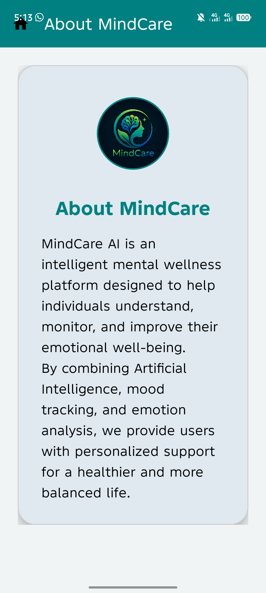 | 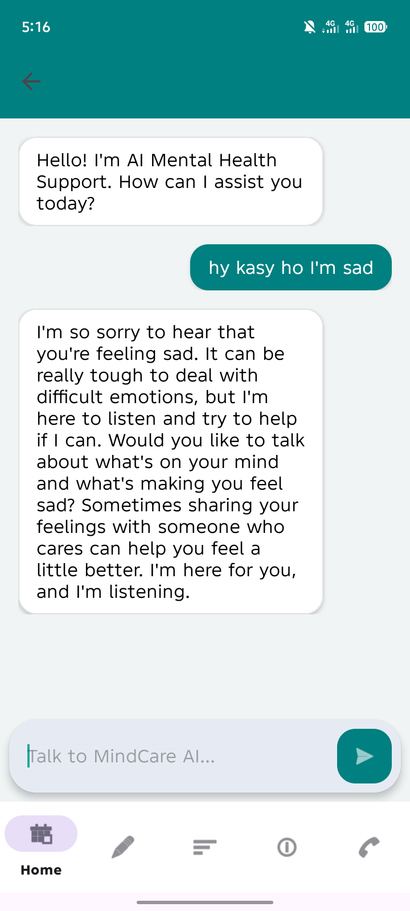 | 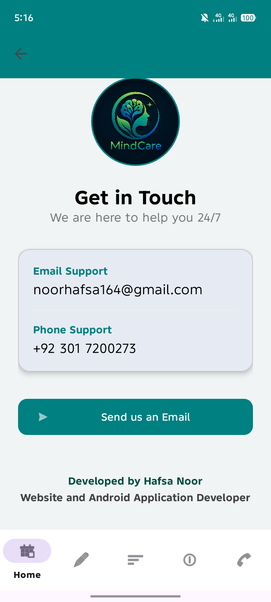 | 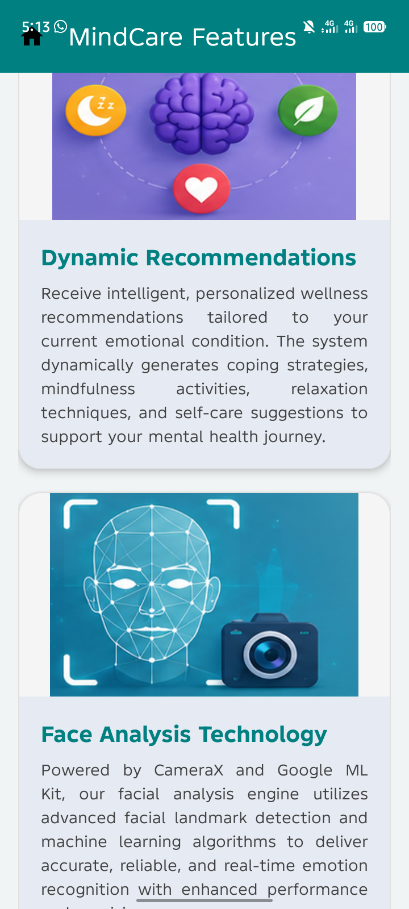 |

| Features | FrontPage | History | Home | HomePage |
|:---:|:---:|:---:|:---:|:---:|
| 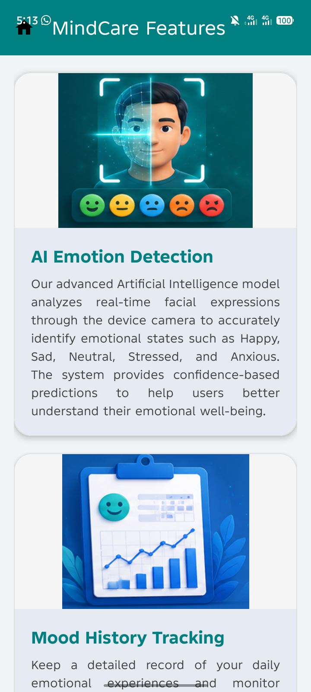 | 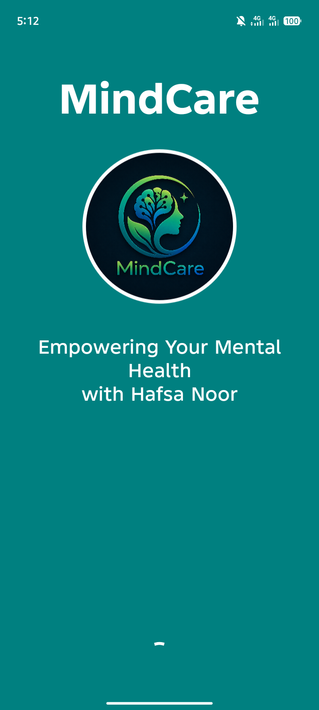 | 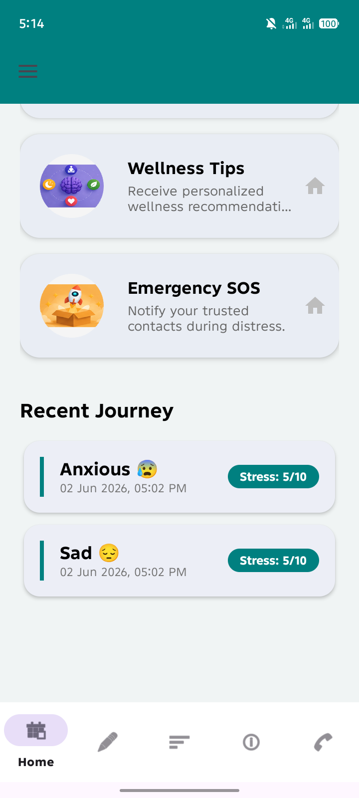 | 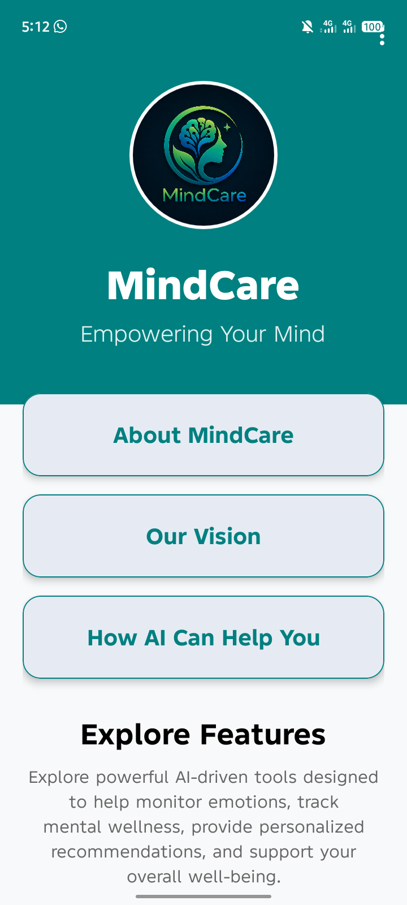 | 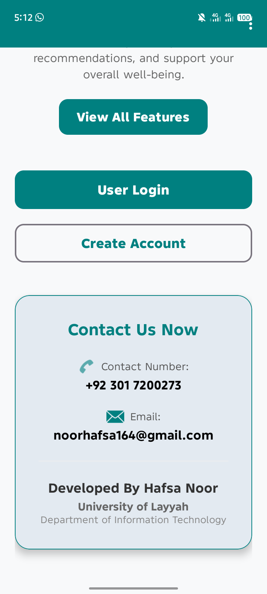 |

| Login | Mood | Privacy | Profile |
|:---:|:---:|:---:|:---:|
| 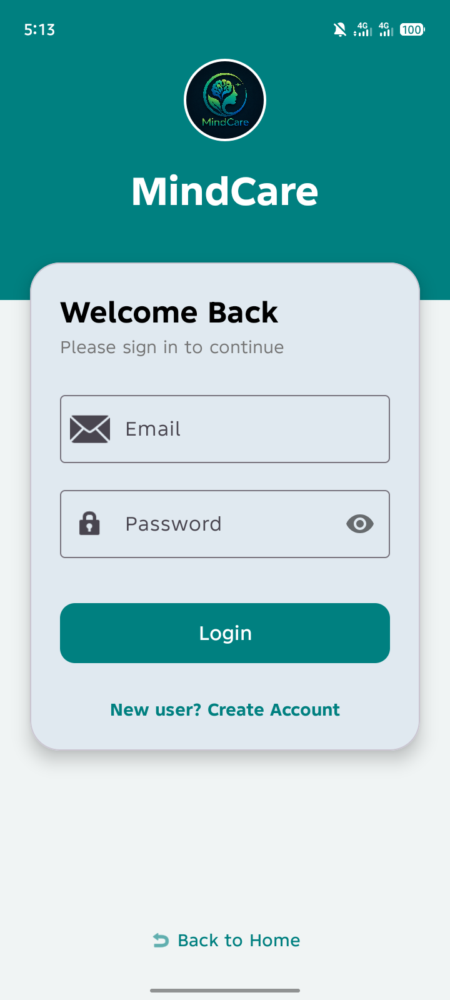 | 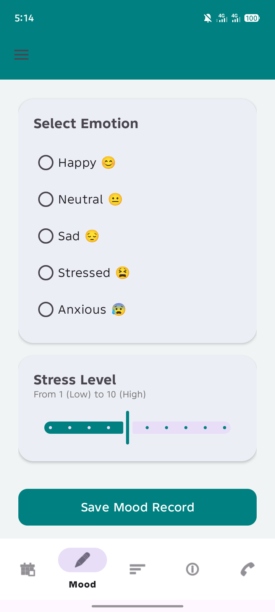 | 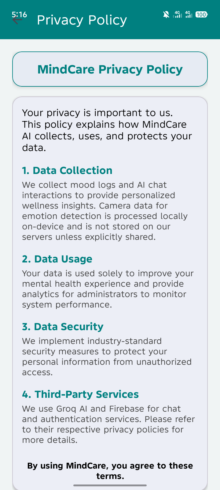 | 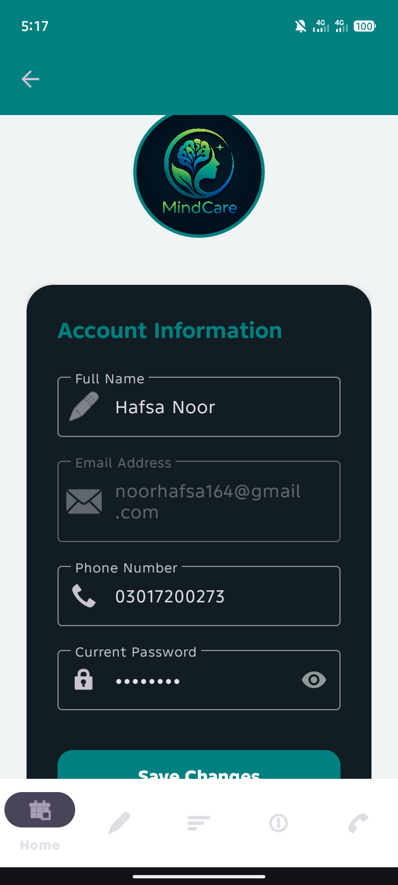 |

| Register | Setting | Wellness |
|:---:|:---:|:---:|
| 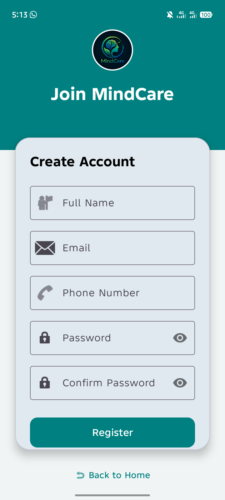 | 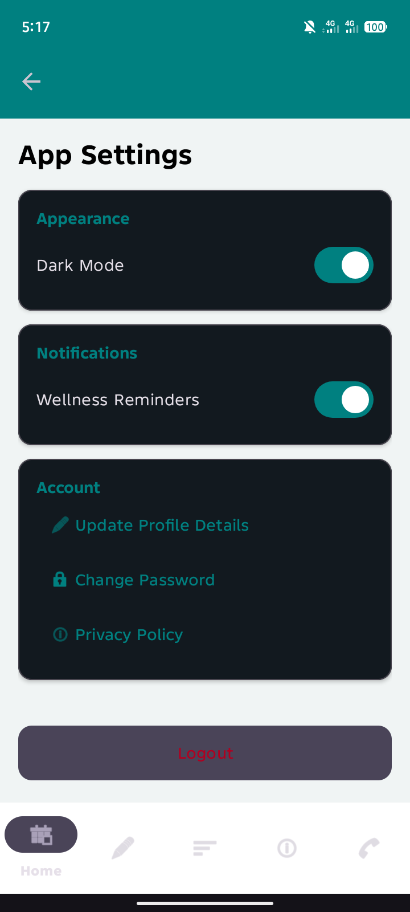 | 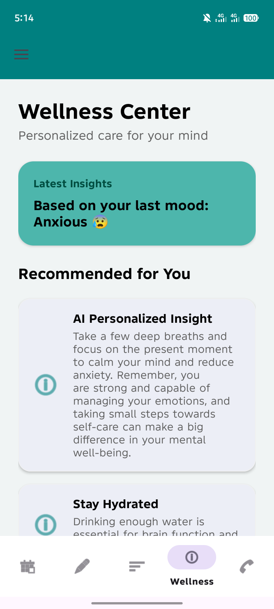 |

## Documentation
For more detailed information, please refer to our project documentation:
- 📖 [User Manual](docs/user_manual.pdf)
- ⚖️ [Privacy Policy](docs/privacy_policy.pdf)

## Features
- **User Authentication:** Secure signup and login via Firebase.
- **Personalized Dashboard:** Overview of your emotional health and activities.
- **AI Mood Tracking:** Log your moods and get AI-driven emotional analysis.
- **AI Chatbot Assistance:** Interactive support powered by Gemini and Groq.
- **Emotion Detection:** Real-time emotion analysis using ML Kit.
- **Wellness Resources:** Curated content to help you stay balanced.
- **Secure Data Storage:** Reliable storage using Room and Firebase.

## Technologies Used
- **Kotlin:** Primary language for modern Android development.
- **Android Studio:** Development environment.
- **Firebase:** Authentication and Cloud Firestore.
- **AI Models:** Google Gemini, Groq API, and TensorFlow Lite.
- **Room Database:** For efficient local data management.
- **Gradle:** Build automation and dependency management.

## Project Downloads
- 📦 [Download MindCare Project (.rar)](https://drive.google.com/file/d/1-JtPfmGsQMIeyUSjNk7vTEutV7Q5RKat/view?usp=drive_link)
- 📱 [Download MindCare APK](apk/MindCare.apk)

## How to Install the APK
1. Download the APK file from the `apk/` folder.
2. Transfer it to your Android device if downloaded on a PC.
3. Open the APK file and allow "Install from unknown sources" if prompted.
4. Follow the on-screen instructions to install and launch.

## How to Run the Project
1. Clone the repository: `git clone https://github.com/HafsaCodeOrbit/MindCare.git`
2. Open the project in **Android Studio**.
3. Let Gradle sync and download all dependencies.
4. Place your `google-services.json` inside the `app/` directory.
5. Add your API keys (`GROQ_API_KEY`, `GEMINI_API_KEY`) to `local.properties`.
6. Click **Run** to deploy the app on your emulator or physical device.

## Future Enhancements
- **Admin Dashboard:** For managing resources and user analytics.
- **Push Notifications:** Reminders for daily mood check-ins.
- **Advanced Reports:** Exportable PDF reports of emotional trends.
- **Community Support:** Safe forums for peer interaction.

## Developed By
**Hafsa Noor**  
BSIT, Semester 6th  
Department of Information Technology  
University of Layyah

**GitHub:** [https://github.com/HafsaCodeOrbit](https://github.com/HafsaCodeOrbit)  
**LinkedIn:** [Your LinkedIn Profile Link]

---
© 2026 MindCare. All Rights Reserved.
